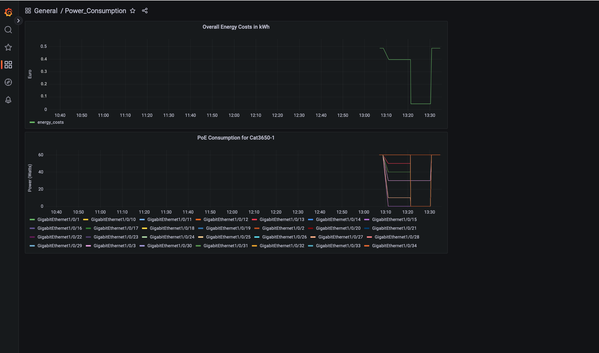

# GVE DevNet Catalyst POE Consumption Monitoring

With rising energy prices, the subject of energy consumption is becoming increasingly important.
This demo shows how to create a Grafana Dashboard visualizing the energy consumption of each interface of a Catalyst switch over time. Further, the overall energy costs of a deployment is visualized based on a provided kWh price. 
In the backend, the data is retrieved via pyATS and stored in a InfluxDB. 

> **Note:** This demo focuses on the data visualization of a single Catalyst 3650 switch. Adding further devices is possible by adapting the following files accordingly: **grafana/dashboards/grafana-dashboard.json:** duplicate the second panel dict and adapt the device name in the title and query field, **app-code/sample_testbed.yaml:** add a new device manually or use [automatic generation of YAML files based on Excel](https://pubhub.devnetcloud.com/media/pyats-getting-started/docs/quickstart/manageconnections.html#creation-from-excel-file). Instead of adapting the grafana-dashboard.json file, it also is possible to add a new panel within the Grafana UI. 

## Wokflow


## Architecture


## Screenshot




## Contacts
* Ramona Renner

## Solution Components
* Cisco Catalyst 3650 Switch
* pyATS
* Grafana
* InfluxDB

## Setup

This demo offers two setup options. Choose your preferred option:
* [Option 1: Setup and Usage as a Docker Container](#option-1-setup-and-usage-as-a-docker-container) 
* [Option 2: Local Setup and Usage](#option-2-local-setup-and-usage)

> The Docker setup option is build based on a repository made by Ignacio Fite.  


## Option 1: Setup and Usage as a Docker Container

1. Install Docker Desktop [here](https://www.docker.com/products/docker-desktop)

2. Clone this Github repository:  
    ```git clone [add github link here]```

3. Navigate to the code directory

    ```cd gve_devnet_catalyst_poe_consumption_monitoring```

4. Copy the following into the .env file and fill in the requested variables:    

    ```python
    TESTBED_FILENAME=sample_testbed.yaml

    # Influx Config
    INFLUX_HOST=influxdb-datasource
    INFLUX_PORT=8086
    INFLUX_ORG=[Add a preferred organization name]
    INFLUX_BUCKET="energy_consumption"
    INFLUX_TOKEN="adminadminadmin-adminadminadmin-adminadminadmin-adminadminadmin=="
    INFLUX_USERNAME="admin"
    INFLUX_PASSWORD="adminadminadmin"

    # Grafana Config
    GRAFANA_HOST=grafana-ui
    GRAFANA_PORT=3000

    # Collector Interval
    COLLECTION_INTERVAL_MINUTES=[Add collection interval value in minutes, e.g. 30]

    #Electricity Price
    kWh_PRICE=[Add energy price in cents per kWh, e.g. 42.2]
    ```
    > **Note:** (Optionally) Define an alternative username, password and token for InfluxDB. These values will be automatically configured for a newly created InfluxDB instance. **Important:** Make sure the new values for password and token have around the same or longer length to prevent errors in the setup process.

5. Adapt the **app-code/sample_testbed.yaml** file based on your environment. Please adapt the following information for your Catalyst switch: 
    * **Name (line 2)**
    * **IP**
    * **Username**
    * **Password**  
    * **Platform** 

    > **Note:** More information on the creation of testbedfiles is available [here](https://pubhub.devnetcloud.com/media/pyats-getting-started/docs/quickstart/manageconnections.html#creating-testbed-yaml-file).

6. Build all images of the container via:

    ```docker-compose build```

7. Start all the containers in the background (-d). Grafana and InfluxDB will be automatically configured.

    ```docker-compose up -d```

    > **Note:** There is a container named influxdb_cli that just needs to run once, this container will do all the setup work for you and afterwards it will stop.

    > **Note:** The containers influxdb_cli and collector need the database to be up and running, that takes some time, you might see both containers restarting a few times before they can do their job.

8. Browse to http://localhost:3000/ to open Grafana and log in using:

    * **Username:** admin
    * **Password:** admin

    It will ask for a password change. Choose your preferred password.

9. Inside Grafana, click on the Search button on the left-side menu, you will see the **Power_Consumption** dashboard if everything worked correctly.

    > **Note:** You can bring down all containers of this sample app with: ```docker-compose down```

    > **Note:** To access the InfluxDB UI browse to http://localhost:8086 and use the username and password defined in the .env file to login.


## Option 2: Local Setup and Usage

### Install and Start Grafana

If you are using macOS, follow the steps in this section. If you are using another OS, follow the associated instructions [here](https://grafana.com/docs/grafana/latest/setup-grafana/installation/).

Follow the instructions below to install Grafana on macOS using `Homebrew`:

1. Open a terminal and enter:

        $ brew update
        $ brew install grafana

2. Start Grafana using the command:
        
        $ brew services start grafana
    
    > **Note:** You can stop Grafana with the command: ```brew services stop grafana```


> **Note:** For more information about the installation on macOS click [here](https://grafana.com/docs/grafana/latest/setup-grafana/installation/mac/).


### Create a Grafana Account and Save the Username and Password

3. Open your web browser and go to http://localhost:3000/
4. On the Grafana sign-in page, enter **admin** as username and password and click **Sign in**
5. If successful, you will see a prompt to change the password.
6. Click OK on the prompt and change your password. Note the username and password, since you will need to add these credentials to your `.env` file later.


### Install and Start InfluxDB

If you are using macOS, follow the steps in this section. If you are using another OS, follow the associated instructions [here](https://docs.influxdata.com/influxdb/v2.6/install/).

7. Open a terminal and enter:

        $ brew update
        $ brew install influxdb

8. Start InfluxDB by entering the following command in the terminal:

        $ influxd

> For more information and alternative ways of InfluxDB installation on macOS click [here](https://docs.influxdata.com/influxdb/v2.6/install/).


### Create an Initial InfluxDB Account and Save the Username and Password

9. Open your web browser and go to http://localhost:8086
10. In the InfluxDB UI, click **Get Started** to start the initial setup process
11. Configure your initial setup by providing the following:
    * **Username**
    * **Password**
    * **Initial organization name**
    * **Initial bucket name** of the PoE consumption data: use **energy_consumption**
    > Note the these values since you will need to add them to your `.env` file later.
12. Press **Continue** 
13. Click **Quick Start** 

### Create an InfluxDB API Token

In the navigation menu on the left,    

14. Select **Data (Load Data)** > **API Tokens**.   
15. Click **Generate API Token** > **Generate a Custom API Token**   
16. Select the **Read** and **Write** option for the initial bucket you created for the PoE consumption data in the last section   
17. Click **Generate**   
    > Note the token, since you will need to add it to your `.env` file later.

More information about the creation of an API Token is available [here](https://docs.influxdata.com/influxdb/v2.6/security/tokens/create-token/#create-a-token-in-the-influxdb-ui)


### Sample Script Installation/Configuration

18. Make sure you have [Python 3.8](https://www.python.org/downloads/) and [Git](https://git-scm.com/book/en/v2/Getting-Started-Installing-Git) installed

19. (Optional) Create and activate a virtual environment for this demo ([Instructions](https://docs.python.org/3/tutorial/venv.html)).

20. Navigate to the created virtual environment folder
    ```
    cd [add name of virtual environment here] 
    ```

21. Clone this GitHub repository:  
  ```git clone [add github link here]```

22. Navigate to the code directory   
    ```cd gve_devnet_catalyst_poe_consumption_monitoring```

23. Install all dependencies:  
  ```pip3 install -r app-docker/requirements.txt```

24. Copy the following into the .env file and fill in the requested variables:    

    ```python
    TESTBED_FILENAME=sample_testbed.yaml

    # Influx Config
    INFLUX_HOST=localhost
    INFLUX_PORT=8086
    INFLUX_ORG=[Add the organization name from step 11]
    INFLUX_BUCKET=[Add the bucket name from step 11]
    INFLUX_TOKEN=[Add the API token from step 17]
    INFLUX_USERNAME=[Add the username from step 11]
    INFLUX_PASSWORD=[Add the password from step 11]

    # Grafana Config
    GRAFANA_HOST=localhost
    GRAFANA_PORT=3000

    # Collector Interval
    COLLECTION_INTERVAL_MINUTES=[Add collection interval value in minutes, e.g. 30]

    #Electricity Price
    kWh_PRICE=[Add energy price in cents per kWh, e.g. 42.2]
    ```

25. Adapt the **app-code/sample_testbed.yaml** file according to your environment. Please fill in the following information for your Catalyst Switch: 
    * **IP**
    * **Username**
    * **Password**
    * **Platform**

26. Start your local InfluxDB instance with the following command in one terminal window:

        $ influxd

27. Start your local Grafana instance with the following command in another terminal window:

        $ brew services start grafana

28. Run your script by typing in the following the commands in the terminal:
        $ cd app-code
        $ python3 main.py


## Add a InfluxDB Data Source to Grafana

In the Grafana Dashboard (under http://localhost:3000/),   
29. Access the data source configuration page via the following steps:    

* Hover the cursor over the **Configuration** (gear) icon.     
* Select **Add Data Sources** > Search and select **InfluxDB**   
* Select **InfluxDB** data source.   

30. Click **Add Data Source**   

31. Set the configuration values as following:  
    * **Name:** InfluxDB   
    * **Query language:** Flux     
    * **URL:** http://localhost:8086     
    * **Basic Auth:** disabled              
    * **Organization:** InfluxDB organization as configured in step 11.   
    * **Token:** InfluxDB token as configured in step 17.      
    * **Default Bucket:** InfluxDB default bucket as configured in step 11. 

32. Click **Save & Test**

> **Note:** More information about InfluxDB data sources in Grafana is available [here](https://grafana.com/docs/grafana/latest/datasources/influxdb/).


## Import the Dashboard to Grafana

A Grafana JSON file contains everything you need, including layout, variables, styles, data sources, queries, and so on, so that you can later import the dashboard.

In the Grafana Dashboard (under http://localhost:3000/),

33. Click **Dashboards** > **Import** in the side menu
34. Click **Upload JSON file** > select the **grafana/dashboards/grafana-dashboard.json** file in this repository.
35. Click **Import**
36. You will see the **Power_Consumption** dashboard if everything worked correctly.

> **Note:** More information about importing a dashboard into Grafana is available [here](https://grafana.com/docs/grafana/latest/dashboards/manage-dashboards/#export-and-import-dashboards).


### LICENSE

Provided under Cisco Sample Code License, for details see [LICENSE](LICENSE.md)

### CODE_OF_CONDUCT

Our code of conduct is available [here](CODE_OF_CONDUCT.md)

### CONTRIBUTING

See our contributing guidelines [here](CONTRIBUTING.md)

#### DISCLAIMER:
<b>Please note:</b> This script is meant for demo purposes only. All tools/ scripts in this repo are released for use "AS IS" without any warranties of any kind, including, but not limited to their installation, use, or performance. Any use of these scripts and tools is at your own risk. There is no guarantee that they have been through thorough testing in a comparable environment and we are not responsible for any damage or data loss incurred with their use.
You are responsible for reviewing and testing any scripts you run thoroughly before use in any non-testing environment.